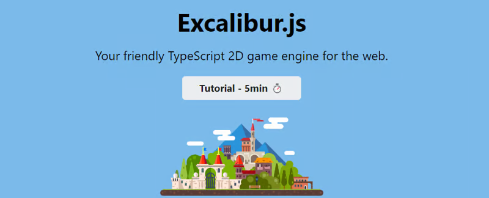

###### Readme top

 

  

  <h3 align="center">Alien Waves</h3>

  

    This is a tower defense game based on the theme of Aliens. Your ship is stranded on an unknown alien planet and you must defend yourself from the waves of aliens that attack your ship!

You can click or touch the playing field to place defense turrets on the level to deal with the waves of Aliens that spawn.

Each level will increase in difficulty, so you really need to be wise regarding how you balance your wave funds between cheap turrets
and the expensive turrets.

There are no AI generated assets in this game.  

  

<!-- ABOUT THE PROJECT -->

## About The Demo

[Itch.io Game Demo](https://mookie4242.itch.io/alien-waves)

## Made with:

- Excalibur
- Excalibur-JSXFR plugin
- Finite State Machines
- Godot-like Signals
- custom 9-slice graphics component

(<a href="#readme-top">back to top</a>)

## Contact

Justin Young - [@jyoung424242 (Twitter)](https://twitter.com/your_username) - [Mookie4242 (itch.io)](https://mookie4242.itch.io/)

Project Link: [GitHub Repo: AlienTowerDefense](https://github.com/jyoung4242/AlienTowerDefense)

(<a href="#readme-top">back to top</a>)

<!-- ACKNOWLEDGMENTS -->

## About Excalibur.js

Small Plug...

ExcaliburJS is a friendly, TypeScript 2D game engine that can produce games for the web. It is free and open source (FOSS), well
documented, and has a growing, healthy community of gamedevs working with it and supporting each other. There is a great discord
channel for it JOIN HERE, for questions and inquiries. Check it out!!!

## Acknowledgments

The alien sprites were created with the Kenney's Creature Mixer tool. [Kenney's Creature Mixer](https://kenney.itch.io/creature-mixer)

The blast sprites from the turrets use particle sprites from Kenney's Particle Pack.
[Kenney's Particle Pack](https://www.kenney.nl/assets/particle-pack)

The ship is from Kenney's Ship Mixer tool. [Kenney's Ship Mixer](https://kenney.itch.io/ship-mixer)

The turrets I drew in Aseprite.

Sound Effects are generated with the Excalibur JSFXR plugin which I created.

Background Music is using a Chiptune generator I created from a fork of Vitling's Autotracker
[Vitling's Autotracker](https://www.vitling.xyz/toys/autotracker/)

Level texture was used from Itch.io texture pack Texture Pack from user FlakDeau19... special thanks to them for their VERY permission
license. [Texture Pack](https://flakdeau19.itch.io/pixel-art-texture-pack-256x256)

(<a href="#readme-top">back to top</a>)

